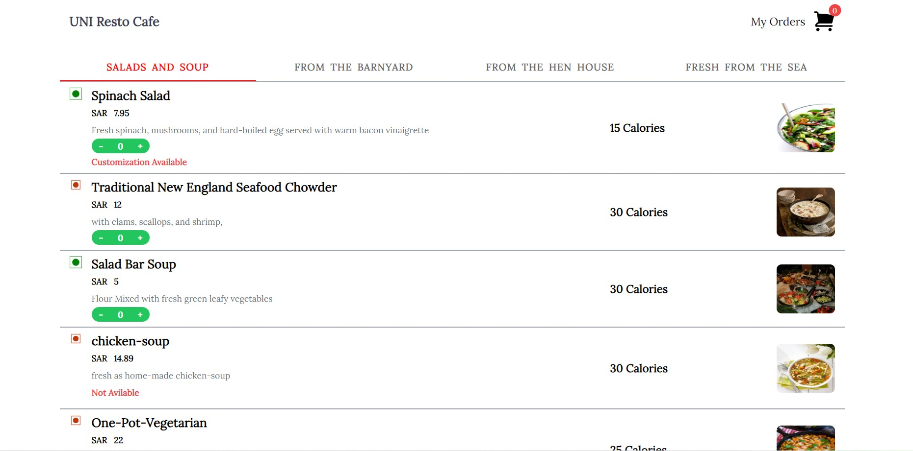

# Zarteck React App with Tailwind CSS

This project was created by **Jishnu** as a showcase of a React application styled with Tailwind CSS, developed for **Zarteck**.

## About the Project

Welcome to the **Zarteck React App**! This project demonstrates the seamless integration of React and Tailwind CSS to create a visually appealing and responsive web application.

### Features

- **Modern UI:** The app boasts a modern user interface, designed to provide a smooth and enjoyable experience for users.
- **Responsive Design:** The application is built with responsiveness in mind, ensuring it looks great on various screen sizes and devices.
- **Effortless Development:** This project was bootstrapped using Create React App, streamlining the development process.
- **Easy Styling with Tailwind CSS:** Tailwind CSS offers a utility-first approach to styling, allowing for rapid UI development without sacrificing customizability.

## Getting Started

To run this project locally, follow these steps:

1. Clone this repository to your local machine.
2. Navigate to the project directory in your terminal.
3. Run `npm install` to install the required dependencies.
4. Execute `npm start` to launch the development server.
5. Open your browser and go to [http://localhost:3000](http://localhost:3000) to view the app.

## Available Scripts

In the project directory, you can use the following npm scripts:

- `npm start`: Runs the app in development mode, accessible at [http://localhost:3000](http://localhost:3000).
- `npm test`: Launches the interactive test runner.
- `npm run build`: Builds the app for production, optimizing performance and creating production-ready assets.

## Learn More

- To learn more about React, check out the [React documentation](https://reactjs.org/).
- To explore Tailwind CSS and its features, visit the [Tailwind CSS documentation](https://tailwindcss.com/).

## Deployment

For information on deploying this app, refer to the [Create React App deployment documentation](https://facebook.github.io/create-react-app/docs/deployment).

## Contact

For any inquiries or feedback, feel free to reach out to the creator, **Jishnu**, at pjishnu506@gmail.com. Your input is greatly appreciated!
